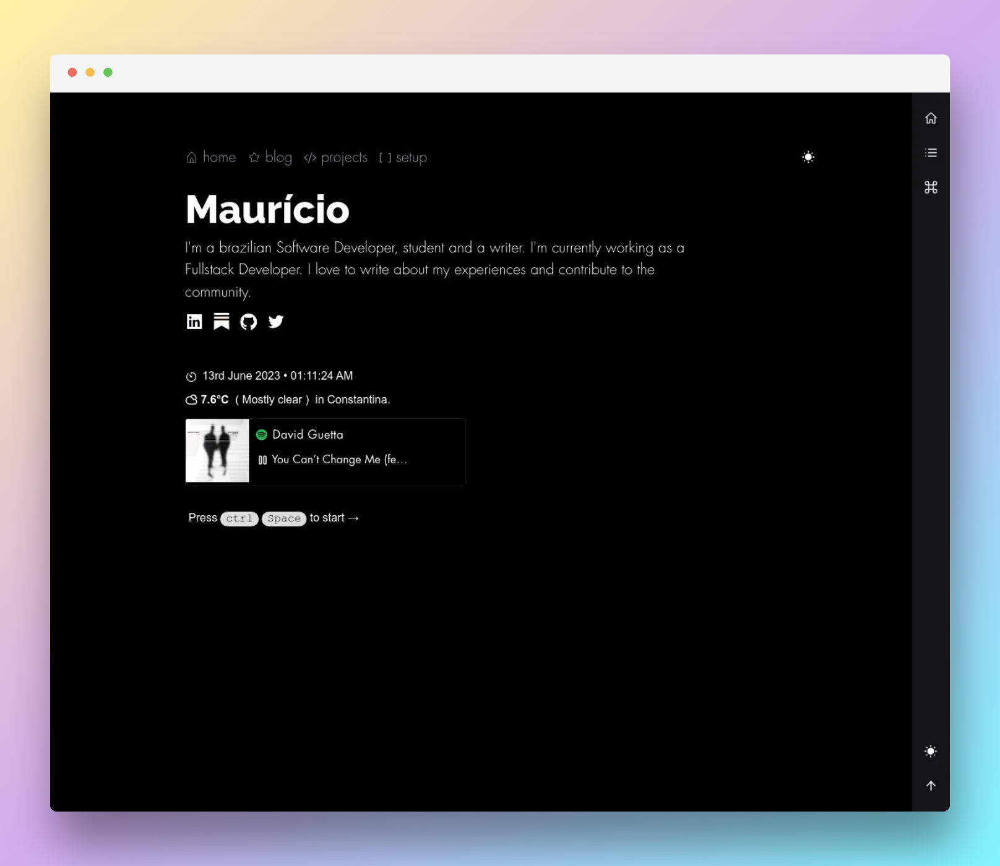

<h2 align="center">Maurício Witter - My Personal Website</h2>

  

## Features

- [x] Homepage
- [x] Blog list
- [x] Blog Post
- [x] Projects
- [x] Theme Switcher
- [x] ISR (Incremental Static Regeneration)
- [x] Portfolio
- [x] SEO
- [x] PWA (Progressive Web App)
- [x] Feed RSS (XML, JSON, ATOM)
- [x] Sitemap
- [x] Robots.txt
- [x] Vercel Analytics
- [ ] About
- [ ] [i18n](https://i18nexus.com/tutorials/nextjs/react-i18next)
- [x] Loading
- [ ] Pagination
- [x] Code splitting
- [ ] Search by tags
- [ ] Match theme with OS
- [ ] Font loading https://web.dev/i18n/pt/optimize-webfont-loading/

## License

The source-code is under the [MIT license](LICENSE) and the blog posts are under the [CC BY-SA 4.0](LICENSE-posts) license

[![CC BY-SA 4.0][cc-by-sa-shield]][cc-by-sa] 

This work is licensed under a
[Creative Commons Attribution-ShareAlike 4.0 International License][cc-by-sa].

[![CC BY-SA 4.0][cc-by-sa-image]][cc-by-sa]

[cc-by-sa]: http://creativecommons.org/licenses/by-sa/4.0/
[cc-by-sa-image]: https://licensebuttons.net/l/by-sa/4.0/88x31.png
[cc-by-sa-shield]: https://img.shields.io/badge/License-CC%20BY--SA%204.0-lightgrey.svg
